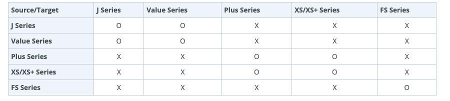
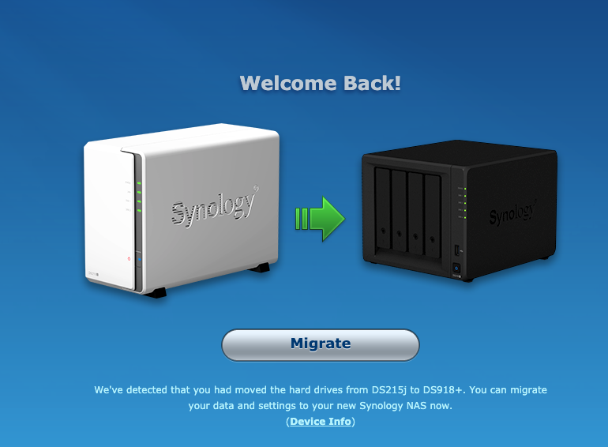

# Set Up Home Cloud with Synology NAS

## Migrate from 215j to 918+

I bought a two-bay 215j in 2016 with 2 4TB NAS Red WD HDDs on SHR-1 (Synology Hybrid RAID) configuration. In 2019 this setup looks increasingly inadequate as my video library grows and I want to set up a home Ubuntu server. Synology provides a good [NAS selector tool](https://www.synology.com/en-us/support/nas_selector). A few factors led me to the decision to buy 918+. 

First, I want a 4-bay NAS so that I can use [RAID 10, which requires minimum 4 HDDs](https://www.synology.com/en-us/knowledgebase/DSM/help/DSM/StorageManager/storage_pool_what_is_raid). A lot of websites suggest RAID 5, but I'm been advised to [stay away from RAID 5 at all costs](https://www.askdbmgt.com/why-raid5-should-be-avoided-at-all-costs.html) and stick with RAID 10. Synology has a neat [RAID calculator](https://www.synology.com/en-us/support/RAID_calculator). RAID 10 can only use 50% of the disk space but seems to be have the right balance of redundancy and efficiency. So 4-bay it is then.

Second, I wante to set up a home server to run Ubuntu 18.04. Package [Virtual Machine Manager](https://www.synology.com/en-us/dsm/feature/virtual_machine_manager) needs to be installed to manage virtual machines on Synology. This package is only available on [selected models](https://www.synology.com/en-us/dsm/packages/Virtualization). 215j is not on this list and 918+ is. Also, running Ubuntu 18.04 requires at least 2GB of RAM, on top of the RAM requirement for other tasks in NAS

I placed an order on Tmall for a 918+ with 2 additional 4TB WD Red HDD and 4GB additional RAM, and they were delivered the next day. Here we go, the strenuous journey of configuring a new NAS. 

The first important task was to migrate the data from existing 215j to the new shining 918+. This was complicated, tricky, dangerous, and ultimately, smooth. Synology has a [comprehensive guide on 3 methods](https://www.synology.com/en-us/knowledgebase/DSM/tutorial/General_Setup/How_to_migrate_between_Synology_NAS_DSM_6_0_and_later), HDD Migration, Migration via Migration Assistant, and Migration via Hyper Backup. According to this chart, HDD migration is not available in my case, as my source is a J Series and my target is a Plus Series.



According to [this Synology article](https://www.synology.com/en-us/knowledgebase/DSM/tutorial/Management/Which_Synology_NAS_models_does_Migration_Assistant_Support), the second mthod with Migration Assistant is not available to me either as 215j is not on the list. 

I was left with only Option 3 - Hyper Backup. This is a challenging path - I don't have a destination server or local hard disk that can do a backup of more than 3TB data from my 215j. I realized later I would need to have a local hard disk anyway that is big enough to backup NAS data, but at this point, I just felt this option was not available to me as well.

Encouraged by some online blog articles, I took on Option 1. I removed the 2 HDDs from 215j, placed them in the same slot (drive 1 and driver 2 on 918+), and powered up 918+. Miraculously, 918+ recognized the disks from 215j! After all, we don't have to follow Synology's guide to each word. 

 

The rest of the migration was a breeze and completed fairly quickly. All the data got on 918+ once and for all, along with the shared folders and user configurations. 918+ just thoroughly took over 215j. 

At this point, I have all 4 HDDs on 918+; 2 are existing ones from 215j on Volume 1; 2 are new ones just bought. Can't remember now what I did exactly, but I believe I added the 2 new HDDs to the existing Storage Pool, which triggered a long parity consistency check that was a bit anticlimatic but seemed to be a very common experience for NAS users. It finished after 30+ hours I think. 

In the past when on 2-bay 215j I never paid much attention to the fine differences between Volume, Storage Pool and RAID type. It was just 1 single volume, 1 storage pool, and SHR-1 almost out of box. That combo worked well for 3 years. I soon realized the entangled complexities of these three notions, plus ext4 vs Btrfs, and their interwined dependencies. The education of these concepts is beyond the scope of this guide, but here's a set of important rules I figured out painstakingly after exhausting all the related articles from Synology Knowledgebase and [Reddit](https://www.reddit.com/r/synology/). 

1. [SHR and RAID cannot be changed into each other](https://www.synology.com/en-us/knowledgebase/DSM/tutorial/Storage/Why_cant_I_change_RAID1_to_SHR_or_vice_versa). SHR-1 can only be changed into SHR-2, not any type of RAID.
2. Storage tool must be created first, in order to create a volume.
3. [Creating a new storage pool will delete data on the HDDs](https://www.synology.com/en-us/knowledgebase/DSM/help/DSM/StorageManager/storage_pool_create_storage_pool) that will be added to the storage pool. 
4. [Go `Better Performance` for RAID, and `Higher Flexibility` for SHR](https://synoguide.com/2019/03/23/synology-2019-configuration-guide-part-2-configure-your-hard-drives-or-storage-pool-raid-or-shr/).
5. RAID decision is made when creating a storage pool. In most cases, one single storage pool should be sufficient for home use (unless you want different RAID for different data), and all the HDDs will be added to this single storage pool.
6. One storage pool can have multiple volumes. Having multiple volumes is a common practice. For example, one volume on ext4 and the other one on Btrfs. 
8. [The decision on Btrfs or ext4 is made when creating a new volume](https://www.synology.com/en-us/knowledgebase/DSM/tutorial/Storage/How_to_change_from_ext4_volume_to_btrfs_volume). 
9. [Removing a volume will delete all data on it](https://www.synology.com/en-us/knowledgebase/DSM/tutorial/Storage/How_to_change_from_ext4_volume_to_btrfs_volume). 
10. Btrfs volume is a hard requirement to use Virtual Machine on Synology.
10. Can't easiy access data on NAS from within the VM. When in the VM, in order to access data/folder on NAS (which is outside of the VM), those folders have to be mounted as network drive, rather than local drive. So, it might be a good idea to allocate more space like 250GB when creating a Btrfs volume for VM, even though the usual requirement for Ubuntu 18.04's installation is about 25-30GB only. 

## Parity Consistency Check

It can take a very long time for Synology to complete parity consistency check. 


Synology's user interface doesn't provide much useful info other than a spinning wheel. It's difficult to estimate how long the whole process will finish. For many users, this process is measured not in hours, but in days or even weeks. 

A quick way to check how long this torturous process is going to take. ssh into the console for the Synology, and:

```
$ cat /proc/mdstat
```

The command will produce this on screen:

```
guizishanren@KunLun:~$ cat /proc/mdstat
Personalities : [linear] [raid0] [raid1] [raid10] [raid6] [raid5] [raid4]
md2 : active raid5 sdc5[3] sda5[2] sdb5[1]
      3902187456 blocks super 1.2 level 5, 64k chunk, algorithm 2 [3/3] [UUU]
      [====>................]  reshape = 22.2% (868984768/3902187456) finish=1593.6min speed=31722K/sec

md1 : active raid1 sda2[0] sdb2[1] sdc2[2] sdd2[3]
      2097088 blocks [4/4] [UUUU]

md0 : active raid1 sdd1[2] sdc1[3] sda1[0] sdb1[1]
      2490176 blocks [4/4] [UUUU]

unused devices: <none>
```

`reshape=22.2%` is the current progress. `finish=1593.6min` indicates when it will finish. In this case, roughly 1.1 day. 

In my experience, the actual time it took for Synology to complete parity consistency check was shorter than what the above estimate suggested. 

## Reference

[Synology: How many virtual machines can I run on my Synology NAS?](https://www.synology.com/en-global/knowledgebase/DSM/tutorial/Virtualization/How_many_virtual_machines_can_I_run_on_my_Synology_NAS)

[Synology: Virtual Machine Manager](https://www.synology.com/en-us/dsm/packages/Virtualization)

[How to install Ubuntu on Synology](https://blog.pavelsklenar.com/how-to-install-ubuntu-on-synology/)

[Ubuntu Virtual Machine in a Synology NAS](https://www.instructables.com/id/Ubuntu-Virtual-Machine-in-a-Synology-NAS/)

[Does DS218 (pure) support Virtual Machine](https://community.synology.com/enu/forum/10/post/123554)

[How to create a virtual machine on a Synology NAS](https://miketabor.com/how-to-create-a-virtual-machine-on-a-synology-nas/)

[What Is A Virtual Machine? How Do I Put One On My NAS? And What Are The Pros And Cons](https://nascompares.com/2017/07/26/what-is-a-virtual-machine-how-do-i-put-one-on-my-nas-and-what-are-the-pros-and-cons/)

[Which Synology NAS Should I Buy?](https://www.howtogeek.com/348700/which-synology-nas-should-i-buy/)

***

[Back to HitichHikder's Guide by Herbert](README.md)