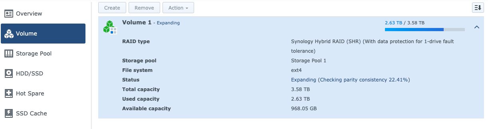

# Set Up Home Cloud with Synology NAS


## Parity Consistency Check

It can take a very long time for Synology to complete parity consistency check. 



Synology's user interface doesn't provide much useful info other than a spinning wheel. It's difficult to estimate how long the whole process will finish. For many users, this process is measured not in hours, but in days or even weeks. 

A quick way to check how long this torturous process is going to take. ssh into the console for the Synology, and:

```
$ cat /proc/mdstat
```

The command will produce this on screen:

```
guizishanren@KunLun:~$ cat /proc/mdstat
Personalities : [linear] [raid0] [raid1] [raid10] [raid6] [raid5] [raid4]
md2 : active raid5 sdc5[3] sda5[2] sdb5[1]
      3902187456 blocks super 1.2 level 5, 64k chunk, algorithm 2 [3/3] [UUU]
      [====>................]  reshape = 22.2% (868984768/3902187456) finish=1593.6min speed=31722K/sec

md1 : active raid1 sda2[0] sdb2[1] sdc2[2] sdd2[3]
      2097088 blocks [4/4] [UUUU]

md0 : active raid1 sdd1[2] sdc1[3] sda1[0] sdb1[1]
      2490176 blocks [4/4] [UUUU]

unused devices: <none>
```

`reshape=22.2%` is the current progress. `finish=1593.6min` indicates when it will finish. In this case, roughly 1.1 day. 

## Reference

[Synology: How many virtual machines can I run on my Synology NAS?](https://www.synology.com/en-global/knowledgebase/DSM/tutorial/Virtualization/How_many_virtual_machines_can_I_run_on_my_Synology_NAS)

[Synology: Virtual Machine Manager](https://www.synology.com/en-us/dsm/packages/Virtualization)

[How to install Ubuntu on Synology](https://blog.pavelsklenar.com/how-to-install-ubuntu-on-synology/)

[Ubuntu Virtual Machine in a Synology NAS](https://www.instructables.com/id/Ubuntu-Virtual-Machine-in-a-Synology-NAS/)

[Does DS218 (pure) support Virtual Machine](https://community.synology.com/enu/forum/10/post/123554)

[How to create a virtual machine on a Synology NAS](https://miketabor.com/how-to-create-a-virtual-machine-on-a-synology-nas/)

[What Is A Virtual Machine? How Do I Put One On My NAS? And What Are The Pros And Cons](https://nascompares.com/2017/07/26/what-is-a-virtual-machine-how-do-i-put-one-on-my-nas-and-what-are-the-pros-and-cons/)

[Which Synology NAS Should I Buy?](https://www.howtogeek.com/348700/which-synology-nas-should-i-buy/)

***

[Back to HitichHikder's Guide by Herbert](README.md)