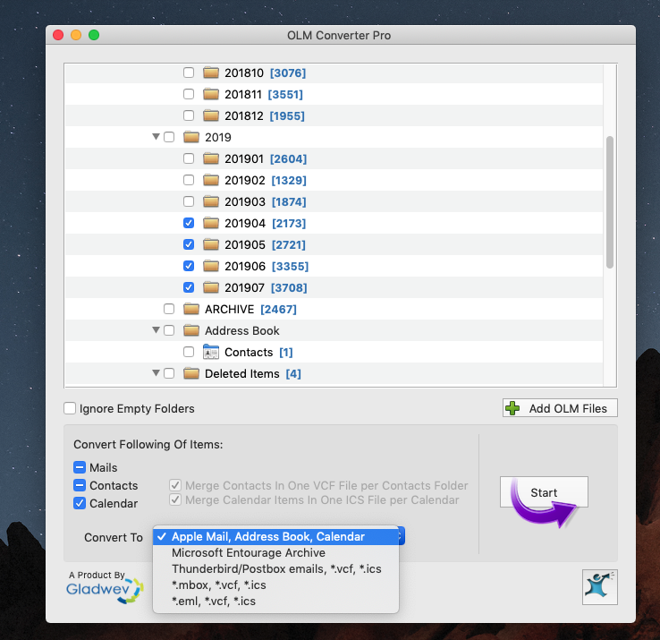

# Migrate Outlook Emails to Gmail

## Sort Outlook emails into monthly folder

In `Archive` local folder, select all emails, sort by `Date Received`. Select all the emails that were received during `YYYYMM`. 

In `Sent` local folder, do the same operation. By now `YYYYMM` folder has all the emails that were received or sent out during YYYYMM. 

Select this `YYYYMM` local folder. In `Outlook/File`, select `Export`, select all the types, and start the export. This will export the entire local folder of your Outlook into one single massive .olm file with complete sub-folder structure. 

## Convert olm files into Apple Mail format

Buy this application, [OLM Converter Pro](https://www.olmconverterpro.com/). 

Open the olm file with OLM Converter Pro. Select only the `YYYYMM` folder. In `Convert To:` option, select `Apple Mail, Address Book, Calendar`. Start the conversion. This will turn the olm file into a folder that has one mbox file for each email sub-folder. 

## Set up Thunderbird and configure new local folders

Right click to open the menu that shows `ImportExportTools`, select `Import mbox file` and `Import directly one or more mbox files`. 

A new folder under `Local Folders` in Thunderbird is created, named by default `mbox`. Change that to a more recognizable name, such as `YYYYMM`. 

## Sync up Gmail with local mbox files

Select `YYYMMM` folder in Thunderbird, select all the emails in this folder, right-click, select `move to` and point to the destination folder `XXX`. This will trigger the migration to move these local emails to the online folder labelled as `XXX` in your Gmail account. This is going to be take a while depending on the Internet connection.

When this process finishes, the local folder in Thunderbird shall be empty. All the emails originally in Outlook will now be available from your Gmail account under the label `XXX`. 

***

[Back to HitichHikder's Guide by Herbert](README.md)